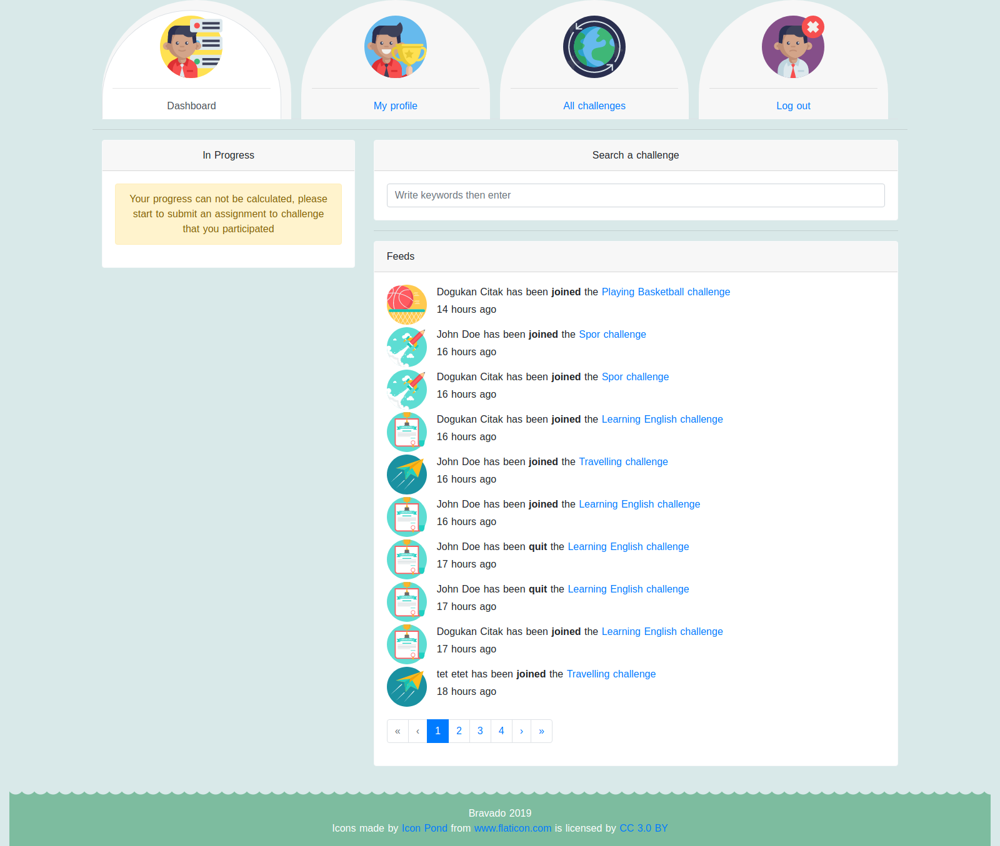
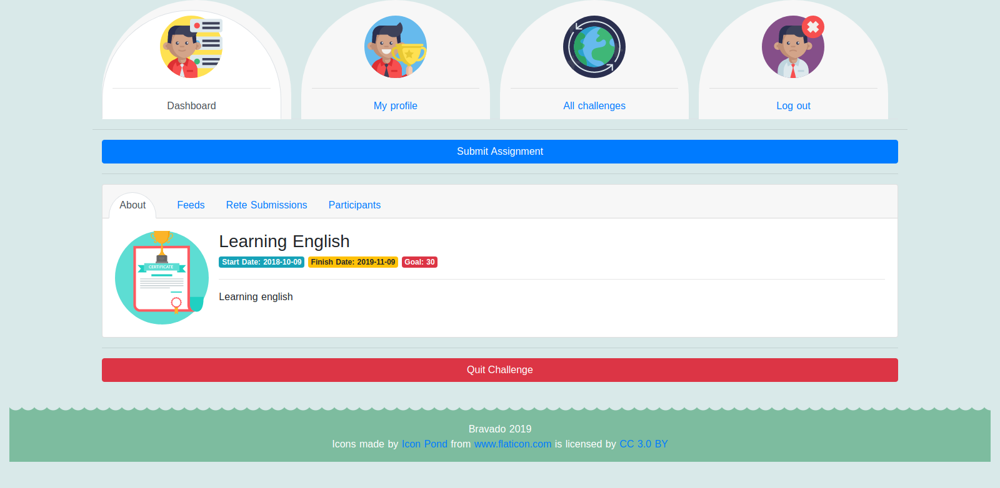

### installation

- run the docker
  `npm run docker`
- create database as `bravado`
- create tables
  `npm run setup`
- run!
  `npm run dev`

### features

- [x] Login
- [x] Register
- [ ] User Profile Page
  - [x] Change Account Settings
  - [x] Completed Challenges
  - [x] Created Challenges
  - [x] In progress challanges
  - [ ] Stability graph
- [x] Dashboard Page
  - [x] User Progress
  - [x] Feeds
  - [x] Search challenge form
- [x] Challenge Page
  - [x] About page
  - [x] Feeds page
  - [x] Participants page
  - [x] Quit Challenge
  - [x] Join Challange
- [ ] Challenge API [CRUD]
  - [x] Create Challenge
  - [x] Get specific Challange
  - [ ] Confirm Challenge
  - [ ] Reject Challenge
  - [ ] Delete Challenge
  - [ ] Update Challenge
- [ ] Manage Category [CRUD]
- [ ] Delete User
- [ ] Comment Challenge
- [ ] Earn Reward
- [x] Submit assignment
- [x] Vote submission

### Use case diagram

### Deployment diagram

### Screenshots

#### index page

#### login register page

#### profile page

#### dashboard page

#### create challenge page

#### challenge page

